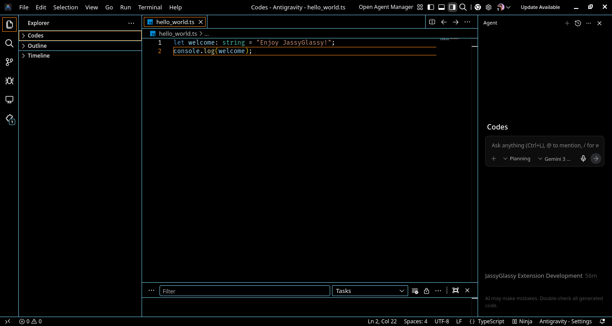
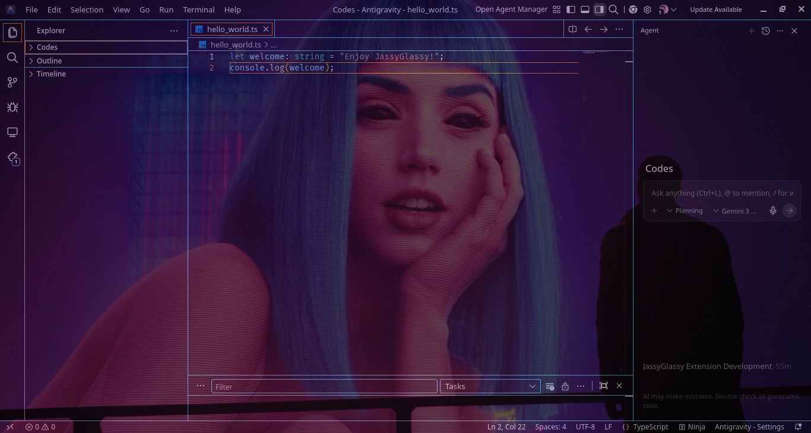
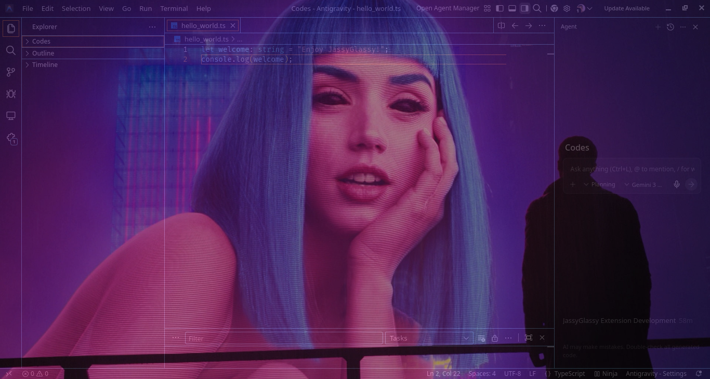
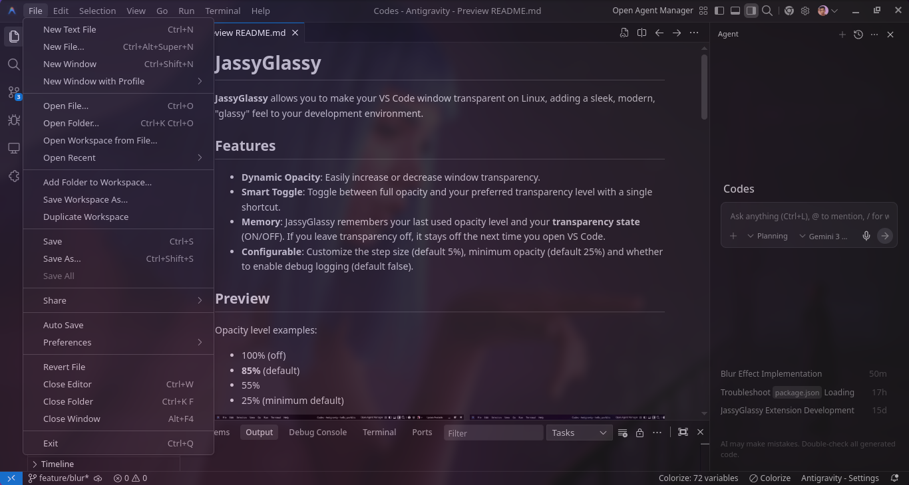

# JassyGlassy

**JassyGlassy** allows you to make your VS Code window transparent on Linux, adding a sleek, modern, "glassy" feel to your development environment.

## Features

- **Dynamic Opacity**: Easily increase or decrease window transparency.
- **Smart Toggle**: Toggle between full opacity and your preferred transparency level with a single shortcut.
- **Memory**: JassyGlassy remembers your last used opacity level and your **transparency state** (ON/OFF). If you leave transparency off, it stays off the next time you open VS Code.
- **Configurable**: Customize the step size (default 5%), minimum opacity (default 25%) and whether to enable debug logging (default false).  

## Preview
Opacity level examples:
* 100% (off)
* **85%** (default)
* 55%
* 25% (minimum default)
<div style="display: flex; overflow-x: auto; gap: 9px; padding: 0px; white-space: nowrap;">
  
  
  
  
</div>

## Requirements

**OS**: Linux (X11 / Xorg) only.

*   This extension utilizes the `xprop` utility to modify window properties.
*   **Wayland** users: This extension may not work on native Wayland sessions unless **XWayland** is handling the window properties correctly.
*   **Windows/macOS**: Not currently supported.

### Installation of Dependencies (if missing)
Most Linux distros have `xprop` installed by default. If not:
*   **Arch/Manjaro**: `sudo pacman -S xorg-xprop`
*   **Debian/Ubuntu**: `sudo apt install x11-utils`
*   **Fedora**: `sudo dnf install xorg-x11-utils`

## Usage (Shortcuts)

| Shortcut | Action | Description |
| :--- | :--- | :--- |
| `Ctrl` + `Alt` + `1` | **Decrease Opacity** | Makes the window more transparent (by 5%). |
| `Ctrl` + `Alt` + `2` | **Increase Opacity** | Makes the window more opaque (by 5%). |
| `Ctrl` + `Alt` + `0` | **Toggle Transparency** | Switches between 100% opaque and your last used setting. |

## Configuration

You can adjust these settings in your `settings.json` or via **File > Preferences > Settings**:

*   `jassyglassy.step`: Percentage to change opacity by (Default: `5`).
*   `jassyglassy.minimum`: Minimum allowed opacity to prevent invisible windows (Default: `25`).
*   `jassyglassy.targetOpacity`: Default opacity level when toggling on (Default: `85`).
*   `jassyglassy.debug`: Enable debug logging (Default: `false`).

## Troubleshooting

**Transparency not working:**
1.  Ensure you are running on X11 (`echo $XDG_SESSION_TYPE` should output `x11`).
2.  Ensure your desktop environment (XFCE, KDE, Gnome) has a **Compositor** enabled. Transparency requires one.  
    *   *Example for XFCE*: Settings **>** Window Manager Tweaks **>** Compositor **>** Enable display compositing.

## Optional: Glass / Blur Effect

  

If you want a blurred "glass" effect rather than just simple transparency, you can use a compatible compositor like **Picom** or **KWin**. 

1.  **Picom**: Disable your desktop’s default compositor, install picom, and run it (ideally create a startup config to make it your new default compositor).  
    *   **Arch/Manjaro**: `sudo pacman -S picom && picom -b`
    *   **Debian/Ubuntu**: `sudo apt install picom && picom -b`
    *   **Fedora**: `sudo dnf install picom && picom -b`  
    *Some Fedora spins may already run a compositor (Mutter/KWin).*

    Picom does not create a user config by default. If `~/.config/picom/picom.conf` does not exist, copy the example config from `/etc/xdg/picom.conf`:
    ```bash
    mkdir -p ~/.config/picom
    cp /etc/xdg/picom.conf ~/.config/picom/picom.conf
    ```

    Then make sure your `picom.conf` includes the following settings:  
    ```conf
    backend = "glx";
    blur-background = true;
    blur-method = "dual_kawase"; 
    blur-strength = 3; // Adjust as needed
    ```
2.  **KDE Plasma**: Blur is often supported natively by KWin and can be customized in the System Settings **>** Desktop Effects.

Once blur is enabled in your compositor, JassyGlassy's transparency will naturally reveal a beautifully blurred background.
